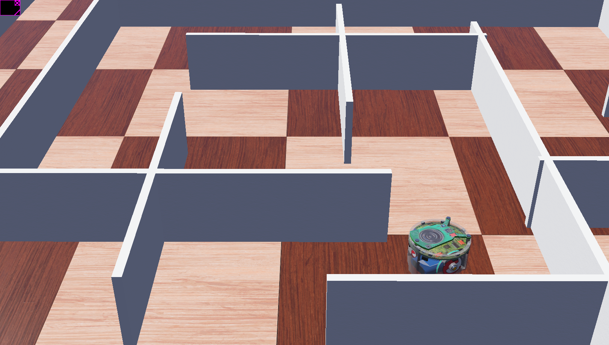

# ENGN1211-Rover
First year ANU engineering course end-of-semester rover project

# IR Left-Following E-Puck Simulation (Webots)

## Overview
This project contains a Webots-based simulation of an e-puck robot implementing a left-wall-following navigation algorithm. The system was developed to test autonomous navigation logic prior to physical rover implementation, allowing early validation of obstacle avoidance and path-following behaviour.

## Simulation Platform
The simulation was built using **Webots** and the **e-puck robot model**, which provides multiple infrared (IR) sensors for proximity detection. The virtual environment includes a custom maze designed to evaluate navigation performance under constrained path widths.

## Sensors Used
The navigation algorithm uses the following IR sensors:
- Front IR sensor
- Front-left IR sensor
- Left IR sensor

These sensors provide real-time obstacle detection for wall following and turning decisions.

## Control Algorithm
A left-wall-following algorithm was implemented to maintain contact with the left-hand boundary of the maze. The logic prioritises:
1. Turning left when a path is available
2. Moving forward when clear
3. Turning right or adjusting when obstacles are detected

Artificial pauses were introduced to simulate the slower response of the physical rover’s sonar and servo scanning system. This was necessary because the real rover uses a single sensor mounted on a servo, compared to the faster multi-sensor IR array on the e-puck.

## Results
The robot successfully completed the maze in simulation. Minor collisions occurred in some sections due to the robot’s turning radius being slightly too large for narrow corridor widths. This limitation could be improved through parameter tuning of wheel speeds and turning thresholds.

## Repository Structure
- `controllers/` – e-puck control code (left-wall-following implementation)
- `worlds/` – Webots maze environment
- `protos/` – robot/environment definitions
- `Media/` – screenshots and documentation of simulation results

To use the simulation, simply open the `mazeWorld.wbt` World in the Webots application.

